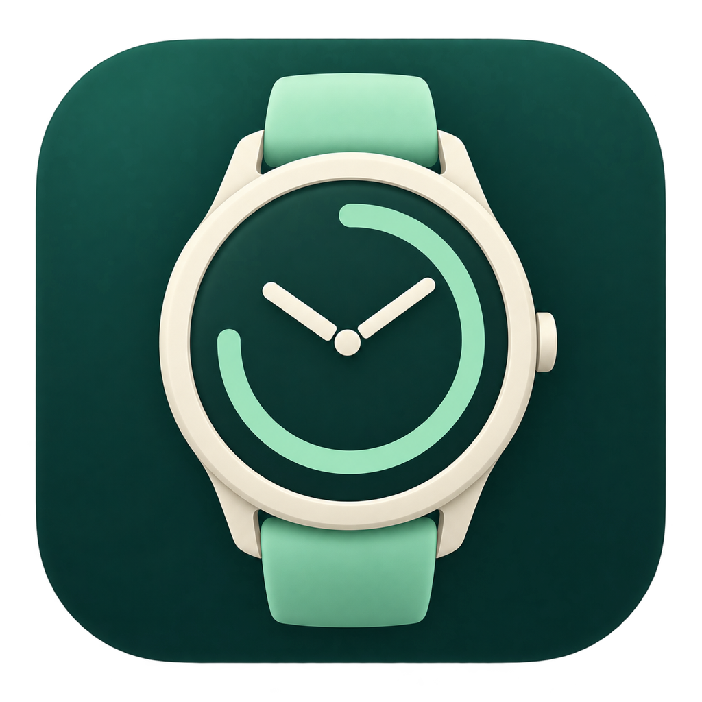

# GarminDesk

Your Garmin Connect data in a native Mac app and desktop widgets. Five widget types for your day, sport, sleep, and training calendar, including a customizable Summary.

[Download](https://github.com/sifushka322/garmin-widget-macos/releases/tag/v0.5.0) · [Installation](docs/distribution.md) · [Version 0.5.0](docs/releases/0.5.0.md)

The current source prepares **0.6.0 build 12**, adding a menu-bar app and metric
interpretations. See the [0.6.0 notes](docs/releases/0.6.0.md) and
[validation audit](docs/audit-0.6.0.md). The download above remains the published 0.5.0.

GarminDesk shows the latest available readings, not a live stream from your watch. Instantaneous heart rate is excluded because Garmin Connect delays make a reliable live reading impossible. Sleep, overnight HRV, sleep respiration, and other completed records retain their dates and are not marked stale solely because synchronization is delayed.

## Installation

1. Download **GarminDesk-0.5.0-arm64.dmg** for Apple Silicon or **GarminDesk-0.5.0-x86_64.dmg** for an Intel Mac.
2. Open the DMG, drag **GarminDesk.app** into **Applications**, and launch it from there.
3. Sign in to Garmin Connect under **Garmin account**.
4. Under **Widgets**, choose an appearance and preview the five widget types. Customize Summary through **Choose measurements**.
5. Right-click the desktop → **Edit Widgets → GarminDesk**, then add a widget.

A ZIP containing the same app is also available. **No Python, Homebrew, additional libraries, or terminal setup is required.** Separate Apple Silicon and Intel packages target macOS 14+. See the [release notes](docs/releases/0.5.0.md) for the version's actual validation coverage.

The app is distributed without a paid Developer ID certificate or Apple notarization. If macOS reports an unidentified developer, first try opening your trusted download, then use **System Settings → Privacy & Security → Open Anyway**. [Apple's instructions](https://support.apple.com/102445).

## Features

**Version 0.5.0** simplifies widget setup with five types and no profiles or assignments. [Normal system-widget upgrade validation remains NOT RUN](docs/releases/0.5.0.md#validation-and-release-limits).

- **Five widget types:** Summary, Day, Sport, Sleep, and Training calendar. Each supports small, medium, and large sizes.
- **One large Summary** combines the main daily, sport, and sleep measurements in a single layout. Choose its measurements directly; the calendar stays in Training. Add another widget for detail, such as sleep stages.
- **No profiles or assignments.** Choose a widget directly in the macOS gallery. Summary has one shared ordered measurement selection; the other types use purpose-specific defaults. Missing readings are skipped automatically.
- **Three distinct appearances:** Colorful, Light, and Dark. One setting applies to every desktop widget, with an immediate preview in the app.
- **Twelve languages:** English, Russian, German, French, Spanish, Italian, Brazilian Portuguese, Dutch, Polish, Japanese, Korean, and Simplified Chinese. Follow the system language or choose one under General.
- **Useful gallery previews.** Clearly marked demo readings and a sample calendar show each type before you add it. App previews also use demo values until relevant real data is available.
- **Automatic refresh and a saved session.** Desktop timelines show actual data or a connection/waiting state. Demo previews never replace real readings; retained readings keep their dates.

Clicking a widget opens its view in GarminDesk. Closing the window keeps synchronization running; **⌘Q** quits. New readings require internet access and a watch synced with Garmin Connect. macOS controls widget refresh timing.

[Release notes](docs/releases/0.5.0.md) · [Widget simplification audit](docs/widget-simplification-audit.md)

## Your data stays with you

There is no developer-operated server. GarminDesk connects directly to Garmin using system WebKit; website session data and cached readings stay on your Mac. The widget extension reads a separate snapshot without passwords or cookies. Credentials and personal readings are not included in the source or release packages.

GarminDesk is an unofficial project and is not affiliated with Garmin. Metric availability depends on your device and account; Garmin Connect changes may require an integration update. Do not attach passwords, cookies, tokens, or personal exports to public issues.

## Build from source

A Mac with compatible Swift tools and a macOS SDK is required. The standard app uses system frameworks; Swift Package Manager and Python are not required.

```bash
APP_VERSION=0.6.0 APP_BUILD=12 CONFIGURATION=release bash scripts/build-app.sh
bash scripts/package-release.sh
```

The app and archives are created in `build/`. See the [build documentation](docs/distribution.md#for-developers) for additional options and the optional legacy connector.

[0.2.0 validation history](docs/validation.md) · [Source publication audit](docs/source-publication-audit-2026-09-16.md)

The source is available for noncommercial use under the [PolyForm Noncommercial License 1.0.0](LICENSE.md), with [required notices](NOTICE.md). Commercial use requires separate permission.
